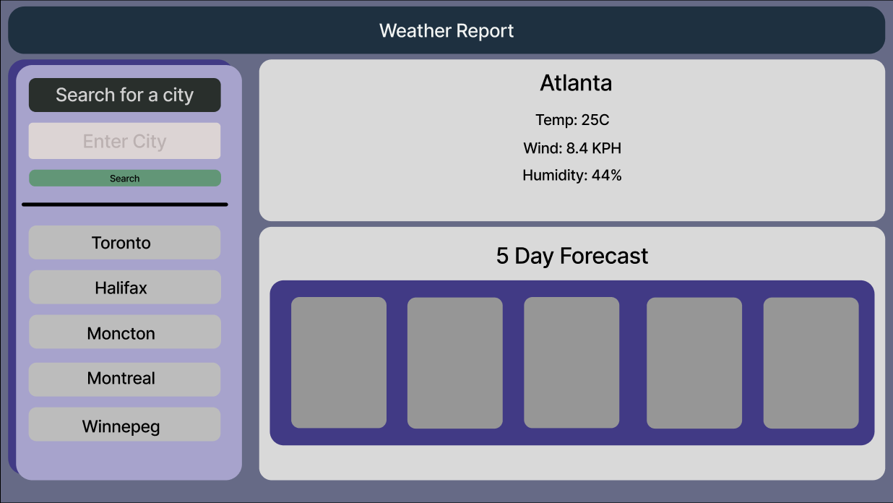
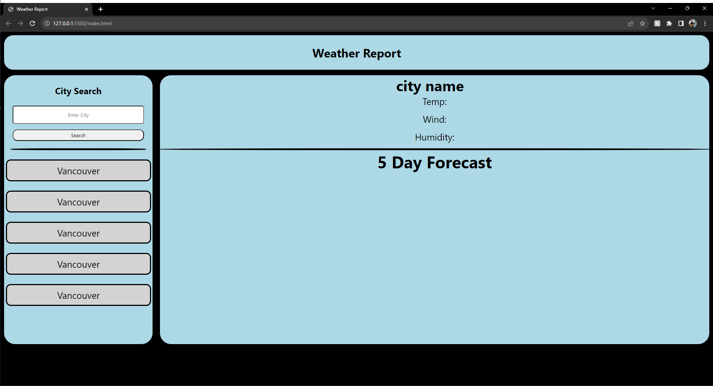

# Weather app
This web application is designed to check the weather in any area of the world!

## Description

- Q: What was the goal of this project?
- A: To make an app that could search for the weather

- Q: What was you biggest challenge for this project?
- A: like last project i would say the local storage part

- Q: What did you learn from this project?
- A: that api's are very usefull .

## Installation

N/A

## Wireframe

I designed a wireframe before i did any coding just so i had a clear picture in my head what i wanted my application to look like.
clearly i need to get better at css.

## Usage

Type in the city you want to check
and once you do it will give you the weather and save your history for you

## Credits

- Joshua Kennedy-Dedam (https://github.com/MagicianJoshua)

